# FAITH Epic — Dependency Graph & Implementation Schedule

**Generated from:** `epic.yaml`
**Date:** 2026-04-02

---

## Task Registry

| Task ID | Task Name | Phase | Status | Dependencies | Complexity | Model |
| --------- | ----------- | ------- | -------- | -------------- | ------------ | ------- |
| FAITH-001 | Project Directory Structure & Base Scaffolding | 1 (Foundation) | DONE | None | S | Haiku / GPT-5.4-mini |
| FAITH-002 | Redis Container Setup | 1 (Foundation) | DONE | FAITH-001 | S | Haiku / GPT-5.4-mini |
| FAITH-003 | Configuration System: YAML Loading & Pydantic Models | 1 (Foundation) | DONE | FAITH-001 | M | Sonnet / GPT-5.4 |
| FAITH-004 | Config Hot-Reload Watcher | 1 (Foundation) | DONE | FAITH-003, FAITH-002 | M | Sonnet / GPT-5.4 |
| FAITH-005 | FAITH CLI (`faith-cli` Package) | 1 (Foundation) | DONE | FAITH-001, FAITH-002 | M | Sonnet / GPT-5.4 |
| FAITH-006 | Config Migration System | 1 (Foundation) | DONE | FAITH-003 | S | Haiku / GPT-5.4-mini |
| FAITH-007 | Compact Protocol Data Models & Serialisation | 2 (Protocol & Events) | DONE | FAITH-002 | M | Sonnet / GPT-5.4 |
| FAITH-008 | Event System Data Models & Publisher | 2 (Protocol & Events) | DONE | FAITH-002 | M | Sonnet / GPT-5.4 |
| FAITH-009 | Event Subscriber & Dispatcher | 2 (Protocol & Events) | DONE | FAITH-008 | M | Sonnet / GPT-5.4 |
| FAITH-010 | Base Agent Class | 3 (Agent Runtime) | DONE | FAITH-007, FAITH-008 | L | Opus / GPT-5.4 high reasoning |
| FAITH-011 | Rolling Context Summary & Compaction | 3 (Agent Runtime) | DONE | FAITH-010 | M | Sonnet / GPT-5.4 |
| FAITH-012 | MCP Adapter Layer | 3 (Agent Runtime) | DONE | FAITH-010 | L | Sonnet / GPT-5.4 |
| FAITH-013 | LLM API Client (Ollama + OpenRouter) | 3 (Agent Runtime) | DONE | FAITH-010 | M | Sonnet / GPT-5.4 |
| FAITH-014 | PA Container Setup & Docker SDK Integration | 4 (PA Core) | IN PROGRESS | FAITH-001, FAITH-002, FAITH-010 | M | Opus / GPT-5.4 high reasoning |
| FAITH-015 | PA Session & Task Management | 4 (PA Core) | IN PROGRESS | FAITH-014, FAITH-057, FAITH-009 | L | Opus / GPT-5.4 high reasoning |
| FAITH-016 | PA Event Dispatcher & Intervention Logic | 4 (PA Core) | DONE | FAITH-015, FAITH-009 | L | Opus / GPT-5.4 high reasoning |
| FAITH-017 | Loop Detection | 4 (PA Core) | DONE | FAITH-016 | M | Sonnet / GPT-5.4 |
| FAITH-018 | Living FRS Management | 4 (PA Core) | DONE | FAITH-015 | M | Opus / GPT-5.4 high reasoning |
| FAITH-019 | Security YAML Schema & Regex Approval Engine | 5 (Security) | IN PROGRESS | FAITH-003 | M | Opus / GPT-5.4 high reasoning |
| FAITH-020 | Approval Request/Response Flow | 5 (Security) | IN PROGRESS | FAITH-019, FAITH-008 | M | Opus / GPT-5.4 high reasoning |
| FAITH-021 | Audit Log System | 5 (Security) | IN PROGRESS | FAITH-008 | M | Sonnet / GPT-5.4 |
| FAITH-022 | Filesystem MCP Server | 6 (Tool Servers) | TODO | FAITH-003, FAITH-008, FAITH-057 | L | Opus / GPT-5.4 high reasoning |
| FAITH-023 | Filesystem File History | 6 (Tool Servers) | TODO | FAITH-022 | M | Sonnet / GPT-5.4 |
| FAITH-024 | Python Execution MCP Server | 6 (Tool Servers) | TODO | FAITH-003, FAITH-008, FAITH-057 | M | Opus / GPT-5.4 high reasoning |
| FAITH-025 | PostgreSQL Database MCP Server | 6 (Tool Servers) | TODO | FAITH-003, FAITH-008 | M | Sonnet / GPT-5.4 |
| FAITH-026 | Browser Automation MCP Server (Playwright) | 6 (Tool Servers) | TODO | FAITH-003, FAITH-008 | L | Sonnet / GPT-5.4 |
| FAITH-027 | Code Index MCP Server (tree-sitter) | 6 (Tool Servers) | TODO | FAITH-022 | L | Opus / GPT-5.4 high reasoning |
| FAITH-028 | RAG / ChromaDB MCP Server | 6 (Tool Servers) | TODO | FAITH-002, FAITH-022 | L | Sonnet / GPT-5.4 |
| FAITH-029 | Git MCP Server | 6 (Tool Servers) | TODO | FAITH-019 | M | Sonnet / GPT-5.4 |
| FAITH-030 | Pricing MCP Server | 6 (Tool Servers) | TODO | FAITH-026, FAITH-008 | M | Sonnet / GPT-5.4 |
| FAITH-031 | Web Search MCP Server | 6 (Tool Servers) | TODO | FAITH-003 | S | Haiku / GPT-5.4-mini |
| FAITH-032 | Full-Text Search MCP Server | 6 (Tool Servers) | TODO | FAITH-022 | S | Haiku / GPT-5.4-mini |
| FAITH-033 | Key-Value Store MCP Server | 6 (Tool Servers) | TODO | FAITH-002 | S | Haiku / GPT-5.4-mini |
| FAITH-034 | CAG Implementation | 7 (CAG & External MCP) | TODO | FAITH-010, FAITH-022 | M | Sonnet / GPT-5.4 |
| FAITH-035 | External MCP Server Registration & Lifecycle | 7 (CAG & External MCP) | TODO | FAITH-014, FAITH-003 | M | Opus / GPT-5.4 high reasoning |
| FAITH-036 | FastAPI Server Setup & WebSocket Endpoints | 8 (Web UI) | DONE | FAITH-002, FAITH-008 | M | Sonnet / GPT-5.4 |
| FAITH-037 | GoldenLayout Panel Framework | 8 (Web UI) | TODO | FAITH-036 | M | Opus / GPT-5.4 high reasoning |
| FAITH-038 | Agent Panel Component (xterm.js + Vue 3) | 8 (Web UI) | TODO | FAITH-037 | M | Sonnet / GPT-5.4 |
| FAITH-039 | Approval Panel Component | 8 (Web UI) | TODO | FAITH-037, FAITH-020 | M | Sonnet / GPT-5.4 |
| FAITH-040 | Status Bar & System Health Panel | 8 (Web UI) | TODO | FAITH-037 | S | Haiku / GPT-5.4-mini |
| FAITH-041 | Input Panel & File Upload | 8 (Web UI) | TODO | FAITH-037 | S | Haiku / GPT-5.4-mini |
| FAITH-042 | Terminal Dark Theme CSS | 8 (Web UI) | TODO | FAITH-037 | S | Haiku / GPT-5.4-mini |
| FAITH-043 | Project Switcher UI | 8 (Web UI) | TODO | FAITH-037, FAITH-015 | S | Haiku / GPT-5.4-mini |
| FAITH-044 | Web UI Log Views | 8 (Web UI) | TODO | FAITH-037, FAITH-021 | M | Opus / GPT-5.4 high reasoning |
| FAITH-045 | Event Log Writer | 9 (Logging) | TODO | FAITH-009 | S | Haiku / GPT-5.4-mini |
| FAITH-046 | Session & Task Log Writer | 9 (Logging) | TODO | FAITH-015 | M | Sonnet / GPT-5.4 |
| FAITH-047 | Token & Cost Log | 9 (Logging) | TODO | FAITH-013, FAITH-030 | S | Haiku / GPT-5.4-mini |
| FAITH-048 | Log Retention & Rotation | 9 (Logging) | TODO | FAITH-021, FAITH-045, FAITH-047 | S | Haiku / GPT-5.4-mini |
| FAITH-049 | First-Run Wizard: Multi-Step UI | 10 (First Run) | TODO | FAITH-036, FAITH-003, FAITH-014, FAITH-057 | L | Opus / GPT-5.4 high reasoning |
| FAITH-050 | Privacy Profile Enforcement & Provider Knowledge Base | 10 (First Run) | TODO | FAITH-049, FAITH-057, FAITH-003 | M | Sonnet / GPT-5.4 |
| FAITH-051 | Ollama Model Download Integration | 10 (First Run) | TODO | FAITH-049, FAITH-057 | S | Sonnet / GPT-5.4 |
| FAITH-052 | Cloud Deployment Architecture | 12 (Cloud) | TODO | FAITH-001, FAITH-002, FAITH-003, FAITH-004, FAITH-005, FAITH-006, FAITH-007, FAITH-008, FAITH-009, FAITH-010, FAITH-011, FAITH-012, FAITH-013, FAITH-014, FAITH-015, FAITH-016, FAITH-017, FAITH-018, FAITH-019, FAITH-020, FAITH-021, FAITH-022, FAITH-023, FAITH-024, FAITH-025, FAITH-026, FAITH-027, FAITH-028, FAITH-029, FAITH-030, FAITH-031, FAITH-032, FAITH-033, FAITH-034, FAITH-035, FAITH-036, FAITH-037, FAITH-038, FAITH-039, FAITH-040, FAITH-041, FAITH-042, FAITH-043, FAITH-044, FAITH-045, FAITH-046, FAITH-047, FAITH-048, FAITH-049, FAITH-050, FAITH-051, FAITH-053, FAITH-054, FAITH-055, FAITH-056, FAITH-057, FAITH-058, FAITH-059 | XL | Opus / GPT-5.4 high reasoning |
| FAITH-053 | First-Run Wizard: Detailed Specification | 10 (First Run) | TODO | FAITH-049, FAITH-057 | M | Sonnet / GPT-5.4 |
| FAITH-054 | `faith run` Command & Task API | 11 (CLI & Skills) | TODO | FAITH-005, FAITH-036, FAITH-015 | M | Sonnet / GPT-5.4 |
| FAITH-055 | Skill Definitions & Unattended Execution | 11 (CLI & Skills) | TODO | FAITH-054, FAITH-019 | M | Opus / GPT-5.4 high reasoning |
| FAITH-056 | Built-in Skill Scheduler | 11 (CLI & Skills) | TODO | FAITH-055, FAITH-004 | M | Opus / GPT-5.4 high reasoning |
| FAITH-057 | Disposable Sandbox Lifecycle & Scheduling | 4 (PA Core) | IN PROGRESS | FAITH-014 | L | Opus / GPT-5.4 high reasoning |
| FAITH-058 | Docker Runtime & Image Panel | 8 (Web UI) | TODO | FAITH-014, FAITH-036, FAITH-037 | M | Sonnet / GPT-5.4 |
| FAITH-059 | Service Route Discovery & `faith show-urls` | 11 (CLI & Skills) | TODO | FAITH-005, FAITH-036 | S | Sonnet / GPT-5.4 |

---

## Mermaid Dependency Diagram

```mermaid
flowchart TD
    %% ── Phase 1: Foundation ──
    FAITH-001["FAITH-001<br/>Project Directory Structure & Base Scaffolding<br/>Phase 1 | DONE | S"]
    FAITH-002["FAITH-002<br/>Redis Container Setup<br/>Phase 1 | DONE | S"]
    FAITH-003["FAITH-003<br/>Configuration System: YAML Loading & Pydantic Models<br/>Phase 1 | DONE | M"]
    FAITH-004["FAITH-004<br/>Config Hot-Reload Watcher<br/>Phase 1 | DONE | M"]
    FAITH-005["FAITH-005<br/>FAITH CLI (`faith-cli` Package)<br/>Phase 1 | DONE | M"]
    FAITH-006["FAITH-006<br/>Config Migration System<br/>Phase 1 | DONE | S"]

    %% ── Phase 2: Protocol & Events ──
    FAITH-007["FAITH-007<br/>Compact Protocol Data Models & Serialisation<br/>Phase 2 | DONE | M"]
    FAITH-008["FAITH-008<br/>Event System Data Models & Publisher<br/>Phase 2 | DONE | M"]
    FAITH-009["FAITH-009<br/>Event Subscriber & Dispatcher<br/>Phase 2 | DONE | M"]

    %% ── Phase 3: Agent Runtime ──
    FAITH-010["FAITH-010<br/>Base Agent Class<br/>Phase 3 | DONE | L"]
    FAITH-011["FAITH-011<br/>Rolling Context Summary & Compaction<br/>Phase 3 | DONE | M"]
    FAITH-012["FAITH-012<br/>MCP Adapter Layer<br/>Phase 3 | DONE | L"]
    FAITH-013["FAITH-013<br/>LLM API Client (Ollama + OpenRouter)<br/>Phase 3 | DONE | M"]

    %% ── Phase 4: PA Core ──
    FAITH-014["FAITH-014<br/>PA Container Setup & Docker SDK Integration<br/>Phase 4 | IN PROGRESS | M"]
    FAITH-015["FAITH-015<br/>PA Session & Task Management<br/>Phase 4 | IN PROGRESS | L"]
    FAITH-016["FAITH-016<br/>PA Event Dispatcher & Intervention Logic<br/>Phase 4 | DONE | L"]
    FAITH-017["FAITH-017<br/>Loop Detection<br/>Phase 4 | DONE | M"]
    FAITH-018["FAITH-018<br/>Living FRS Management<br/>Phase 4 | DONE | M"]
    FAITH-057["FAITH-057<br/>Disposable Sandbox Lifecycle & Scheduling<br/>Phase 4 | IN PROGRESS | L"]

    %% ── Phase 5: Security ──
    FAITH-019["FAITH-019<br/>Security YAML Schema & Regex Approval Engine<br/>Phase 5 | IN PROGRESS | M"]
    FAITH-020["FAITH-020<br/>Approval Request/Response Flow<br/>Phase 5 | IN PROGRESS | M"]
    FAITH-021["FAITH-021<br/>Audit Log System<br/>Phase 5 | IN PROGRESS | M"]

    %% ── Phase 6: Tool Servers ──
    FAITH-022["FAITH-022<br/>Filesystem MCP Server<br/>Phase 6 | TODO | L"]
    FAITH-023["FAITH-023<br/>Filesystem File History<br/>Phase 6 | TODO | M"]
    FAITH-024["FAITH-024<br/>Python Execution MCP Server<br/>Phase 6 | TODO | M"]
    FAITH-025["FAITH-025<br/>PostgreSQL Database MCP Server<br/>Phase 6 | TODO | M"]
    FAITH-026["FAITH-026<br/>Browser Automation MCP Server (Playwright)<br/>Phase 6 | TODO | L"]
    FAITH-027["FAITH-027<br/>Code Index MCP Server (tree-sitter)<br/>Phase 6 | TODO | L"]
    FAITH-028["FAITH-028<br/>RAG / ChromaDB MCP Server<br/>Phase 6 | TODO | L"]
    FAITH-029["FAITH-029<br/>Git MCP Server<br/>Phase 6 | TODO | M"]
    FAITH-030["FAITH-030<br/>Pricing MCP Server<br/>Phase 6 | TODO | M"]
    FAITH-031["FAITH-031<br/>Web Search MCP Server<br/>Phase 6 | TODO | S"]
    FAITH-032["FAITH-032<br/>Full-Text Search MCP Server<br/>Phase 6 | TODO | S"]
    FAITH-033["FAITH-033<br/>Key-Value Store MCP Server<br/>Phase 6 | TODO | S"]

    %% ── Phase 7: CAG & External MCP ──
    FAITH-034["FAITH-034<br/>CAG Implementation<br/>Phase 7 | TODO | M"]
    FAITH-035["FAITH-035<br/>External MCP Server Registration & Lifecycle<br/>Phase 7 | TODO | M"]

    %% ── Phase 8: Web UI ──
    FAITH-036["FAITH-036<br/>FastAPI Server Setup & WebSocket Endpoints<br/>Phase 8 | DONE | M"]
    FAITH-037["FAITH-037<br/>GoldenLayout Panel Framework<br/>Phase 8 | TODO | M"]
    FAITH-038["FAITH-038<br/>Agent Panel Component (xterm.js + Vue 3)<br/>Phase 8 | TODO | M"]
    FAITH-039["FAITH-039<br/>Approval Panel Component<br/>Phase 8 | TODO | M"]
    FAITH-040["FAITH-040<br/>Status Bar & System Health Panel<br/>Phase 8 | TODO | S"]
    FAITH-041["FAITH-041<br/>Input Panel & File Upload<br/>Phase 8 | TODO | S"]
    FAITH-042["FAITH-042<br/>Terminal Dark Theme CSS<br/>Phase 8 | TODO | S"]
    FAITH-043["FAITH-043<br/>Project Switcher UI<br/>Phase 8 | TODO | S"]
    FAITH-044["FAITH-044<br/>Web UI Log Views<br/>Phase 8 | TODO | M"]
    FAITH-058["FAITH-058<br/>Docker Runtime & Image Panel<br/>Phase 8 | TODO | M"]

    %% ── Phase 9: Logging ──
    FAITH-045["FAITH-045<br/>Event Log Writer<br/>Phase 9 | TODO | S"]
    FAITH-046["FAITH-046<br/>Session & Task Log Writer<br/>Phase 9 | TODO | M"]
    FAITH-047["FAITH-047<br/>Token & Cost Log<br/>Phase 9 | TODO | S"]
    FAITH-048["FAITH-048<br/>Log Retention & Rotation<br/>Phase 9 | TODO | S"]

    %% ── Phase 10: First Run ──
    FAITH-049["FAITH-049<br/>First-Run Wizard: Multi-Step UI<br/>Phase 10 | TODO | L"]
    FAITH-050["FAITH-050<br/>Privacy Profile Enforcement & Provider Knowledge Base<br/>Phase 10 | TODO | M"]
    FAITH-051["FAITH-051<br/>Ollama Model Download Integration<br/>Phase 10 | TODO | S"]
    FAITH-053["FAITH-053<br/>First-Run Wizard: Detailed Specification<br/>Phase 10 | TODO | M"]

    %% ── Phase 11: CLI & Skills ──
    FAITH-054["FAITH-054<br/>`faith run` Command & Task API<br/>Phase 11 | TODO | M"]
    FAITH-055["FAITH-055<br/>Skill Definitions & Unattended Execution<br/>Phase 11 | TODO | M"]
    FAITH-056["FAITH-056<br/>Built-in Skill Scheduler<br/>Phase 11 | TODO | M"]
    FAITH-059["FAITH-059<br/>Service Route Discovery & `faith show-urls`<br/>Phase 11 | TODO | S"]

    %% ── Phase 12: Cloud ──
    FAITH-052["FAITH-052<br/>Cloud Deployment Architecture<br/>Phase 12 | TODO | XL"]

    %% ════════════════════════════════════
    %% DEPENDENCY ARROWS
    %% ════════════════════════════════════

    FAITH-001 --> FAITH-002
    FAITH-001 --> FAITH-003
    FAITH-003 --> FAITH-004
    FAITH-002 --> FAITH-004
    FAITH-001 --> FAITH-005
    FAITH-002 --> FAITH-005
    FAITH-003 --> FAITH-006
    FAITH-002 --> FAITH-007
    FAITH-002 --> FAITH-008
    FAITH-008 --> FAITH-009
    FAITH-007 --> FAITH-010
    FAITH-008 --> FAITH-010
    FAITH-010 --> FAITH-011
    FAITH-010 --> FAITH-012
    FAITH-010 --> FAITH-013
    FAITH-001 --> FAITH-014
    FAITH-002 --> FAITH-014
    FAITH-010 --> FAITH-014
    FAITH-014 --> FAITH-015
    FAITH-057 --> FAITH-015
    FAITH-009 --> FAITH-015
    FAITH-015 --> FAITH-016
    FAITH-009 --> FAITH-016
    FAITH-016 --> FAITH-017
    FAITH-015 --> FAITH-018
    FAITH-003 --> FAITH-019
    FAITH-019 --> FAITH-020
    FAITH-008 --> FAITH-020
    FAITH-008 --> FAITH-021
    FAITH-003 --> FAITH-022
    FAITH-008 --> FAITH-022
    FAITH-057 --> FAITH-022
    FAITH-022 --> FAITH-023
    FAITH-003 --> FAITH-024
    FAITH-008 --> FAITH-024
    FAITH-057 --> FAITH-024
    FAITH-003 --> FAITH-025
    FAITH-008 --> FAITH-025
    FAITH-003 --> FAITH-026
    FAITH-008 --> FAITH-026
    FAITH-022 --> FAITH-027
    FAITH-002 --> FAITH-028
    FAITH-022 --> FAITH-028
    FAITH-019 --> FAITH-029
    FAITH-026 --> FAITH-030
    FAITH-008 --> FAITH-030
    FAITH-003 --> FAITH-031
    FAITH-022 --> FAITH-032
    FAITH-002 --> FAITH-033
    FAITH-010 --> FAITH-034
    FAITH-022 --> FAITH-034
    FAITH-014 --> FAITH-035
    FAITH-003 --> FAITH-035
    FAITH-002 --> FAITH-036
    FAITH-008 --> FAITH-036
    FAITH-036 --> FAITH-037
    FAITH-037 --> FAITH-038
    FAITH-037 --> FAITH-039
    FAITH-020 --> FAITH-039
    FAITH-037 --> FAITH-040
    FAITH-037 --> FAITH-041
    FAITH-037 --> FAITH-042
    FAITH-037 --> FAITH-043
    FAITH-015 --> FAITH-043
    FAITH-037 --> FAITH-044
    FAITH-021 --> FAITH-044
    FAITH-009 --> FAITH-045
    FAITH-015 --> FAITH-046
    FAITH-013 --> FAITH-047
    FAITH-030 --> FAITH-047
    FAITH-021 --> FAITH-048
    FAITH-045 --> FAITH-048
    FAITH-047 --> FAITH-048
    FAITH-036 --> FAITH-049
    FAITH-003 --> FAITH-049
    FAITH-014 --> FAITH-049
    FAITH-057 --> FAITH-049
    FAITH-049 --> FAITH-050
    FAITH-057 --> FAITH-050
    FAITH-003 --> FAITH-050
    FAITH-049 --> FAITH-051
    FAITH-057 --> FAITH-051
    FAITH-001 --> FAITH-052
    FAITH-002 --> FAITH-052
    FAITH-003 --> FAITH-052
    FAITH-004 --> FAITH-052
    FAITH-005 --> FAITH-052
    FAITH-006 --> FAITH-052
    FAITH-007 --> FAITH-052
    FAITH-008 --> FAITH-052
    FAITH-009 --> FAITH-052
    FAITH-010 --> FAITH-052
    FAITH-011 --> FAITH-052
    FAITH-012 --> FAITH-052
    FAITH-013 --> FAITH-052
    FAITH-014 --> FAITH-052
    FAITH-015 --> FAITH-052
    FAITH-016 --> FAITH-052
    FAITH-017 --> FAITH-052
    FAITH-018 --> FAITH-052
    FAITH-019 --> FAITH-052
    FAITH-020 --> FAITH-052
    FAITH-021 --> FAITH-052
    FAITH-022 --> FAITH-052
    FAITH-023 --> FAITH-052
    FAITH-024 --> FAITH-052
    FAITH-025 --> FAITH-052
    FAITH-026 --> FAITH-052
    FAITH-027 --> FAITH-052
    FAITH-028 --> FAITH-052
    FAITH-029 --> FAITH-052
    FAITH-030 --> FAITH-052
    FAITH-031 --> FAITH-052
    FAITH-032 --> FAITH-052
    FAITH-033 --> FAITH-052
    FAITH-034 --> FAITH-052
    FAITH-035 --> FAITH-052
    FAITH-036 --> FAITH-052
    FAITH-037 --> FAITH-052
    FAITH-038 --> FAITH-052
    FAITH-039 --> FAITH-052
    FAITH-040 --> FAITH-052
    FAITH-041 --> FAITH-052
    FAITH-042 --> FAITH-052
    FAITH-043 --> FAITH-052
    FAITH-044 --> FAITH-052
    FAITH-045 --> FAITH-052
    FAITH-046 --> FAITH-052
    FAITH-047 --> FAITH-052
    FAITH-048 --> FAITH-052
    FAITH-049 --> FAITH-052
    FAITH-050 --> FAITH-052
    FAITH-051 --> FAITH-052
    FAITH-053 --> FAITH-052
    FAITH-054 --> FAITH-052
    FAITH-055 --> FAITH-052
    FAITH-056 --> FAITH-052
    FAITH-057 --> FAITH-052
    FAITH-058 --> FAITH-052
    FAITH-059 --> FAITH-052
    FAITH-049 --> FAITH-053
    FAITH-057 --> FAITH-053
    FAITH-005 --> FAITH-054
    FAITH-036 --> FAITH-054
    FAITH-015 --> FAITH-054
    FAITH-054 --> FAITH-055
    FAITH-019 --> FAITH-055
    FAITH-055 --> FAITH-056
    FAITH-004 --> FAITH-056
    FAITH-014 --> FAITH-057
    FAITH-014 --> FAITH-058
    FAITH-036 --> FAITH-058
    FAITH-037 --> FAITH-058
    FAITH-005 --> FAITH-059
    FAITH-036 --> FAITH-059

    %% ════════════════════════════════════
    %% PHASE COLOUR CODING
    %% ════════════════════════════════════

    classDef phase1 fill:#1e3a5f,stroke:#4a90d9,color:#ffffff
    classDef phase2 fill:#2d4a22,stroke:#6abf4b,color:#ffffff
    classDef phase3 fill:#5c3d1e,stroke:#d4943a,color:#ffffff
    classDef phase4 fill:#4a1942,stroke:#b84daf,color:#ffffff
    classDef phase5 fill:#5a1a1a,stroke:#e04040,color:#ffffff
    classDef phase6 fill:#1a4a4a,stroke:#40c0c0,color:#ffffff
    classDef phase7 fill:#4a4a1a,stroke:#c0c040,color:#ffffff
    classDef phase8 fill:#2a1a4a,stroke:#8040c0,color:#ffffff
    classDef phase9 fill:#3a2a1a,stroke:#c09040,color:#ffffff
    classDef phase10 fill:#1a3a3a,stroke:#40a0a0,color:#ffffff
    classDef phase11 fill:#3a1a3a,stroke:#a040a0,color:#ffffff
    classDef phase12 fill:#4a0a0a,stroke:#ff4040,color:#ffffff

    class FAITH-001,FAITH-002,FAITH-003,FAITH-004,FAITH-005,FAITH-006 phase1
    class FAITH-007,FAITH-008,FAITH-009 phase2
    class FAITH-010,FAITH-011,FAITH-012,FAITH-013 phase3
    class FAITH-014,FAITH-015,FAITH-016,FAITH-017,FAITH-018,FAITH-057 phase4
    class FAITH-019,FAITH-020,FAITH-021 phase5
    class FAITH-022,FAITH-023,FAITH-024,FAITH-025,FAITH-026,FAITH-027,FAITH-028,FAITH-029,FAITH-030,FAITH-031,FAITH-032,FAITH-033 phase6
    class FAITH-034,FAITH-035 phase7
    class FAITH-036,FAITH-037,FAITH-038,FAITH-039,FAITH-040,FAITH-041,FAITH-042,FAITH-043,FAITH-044,FAITH-058 phase8
    class FAITH-045,FAITH-046,FAITH-047,FAITH-048 phase9
    class FAITH-049,FAITH-050,FAITH-051,FAITH-053 phase10
    class FAITH-054,FAITH-055,FAITH-056,FAITH-059 phase11
    class FAITH-052 phase12
```



---

## 1. Critical Path Analysis

The critical path is the longest weighted dependency chain before cloud deployment.

### Primary Critical Path

```
FAITH-001 -> FAITH-002 -> FAITH-007 -> FAITH-010 -> FAITH-014 -> FAITH-057 -> FAITH-015 -> FAITH-016 -> FAITH-017
```

**Weighted duration estimate:** ~23 days using the epic complexity weights.

---

## 2. Parallel Execution Schedule (Waves)

Each wave contains tasks whose dependencies are fully satisfied by all prior waves.

### Wave 1
| Task | Name | Phase | Status | Complexity |
|------|------|-------|--------|------------|
| FAITH-001 | Project Directory Structure & Base Scaffolding | 1 (Foundation) | DONE | S |

### Wave 2
| Task | Name | Phase | Status | Complexity |
|------|------|-------|--------|------------|
| FAITH-002 | Redis Container Setup | 1 (Foundation) | DONE | S |
| FAITH-003 | Configuration System: YAML Loading & Pydantic Models | 1 (Foundation) | DONE | M |

### Wave 3
| Task | Name | Phase | Status | Complexity |
|------|------|-------|--------|------------|
| FAITH-004 | Config Hot-Reload Watcher | 1 (Foundation) | DONE | M |
| FAITH-005 | FAITH CLI (`faith-cli` Package) | 1 (Foundation) | DONE | M |
| FAITH-006 | Config Migration System | 1 (Foundation) | DONE | S |
| FAITH-007 | Compact Protocol Data Models & Serialisation | 2 (Protocol & Events) | DONE | M |
| FAITH-008 | Event System Data Models & Publisher | 2 (Protocol & Events) | DONE | M |
| FAITH-019 | Security YAML Schema & Regex Approval Engine | 5 (Security) | IN PROGRESS | M |
| FAITH-031 | Web Search MCP Server | 6 (Tool Servers) | TODO | S |
| FAITH-033 | Key-Value Store MCP Server | 6 (Tool Servers) | TODO | S |

### Wave 4
| Task | Name | Phase | Status | Complexity |
|------|------|-------|--------|------------|
| FAITH-009 | Event Subscriber & Dispatcher | 2 (Protocol & Events) | DONE | M |
| FAITH-010 | Base Agent Class | 3 (Agent Runtime) | DONE | L |
| FAITH-020 | Approval Request/Response Flow | 5 (Security) | IN PROGRESS | M |
| FAITH-021 | Audit Log System | 5 (Security) | IN PROGRESS | M |
| FAITH-025 | PostgreSQL Database MCP Server | 6 (Tool Servers) | TODO | M |
| FAITH-026 | Browser Automation MCP Server (Playwright) | 6 (Tool Servers) | TODO | L |
| FAITH-029 | Git MCP Server | 6 (Tool Servers) | TODO | M |
| FAITH-036 | FastAPI Server Setup & WebSocket Endpoints | 8 (Web UI) | DONE | M |

### Wave 5
| Task | Name | Phase | Status | Complexity |
|------|------|-------|--------|------------|
| FAITH-011 | Rolling Context Summary & Compaction | 3 (Agent Runtime) | DONE | M |
| FAITH-012 | MCP Adapter Layer | 3 (Agent Runtime) | DONE | L |
| FAITH-013 | LLM API Client (Ollama + OpenRouter) | 3 (Agent Runtime) | DONE | M |
| FAITH-014 | PA Container Setup & Docker SDK Integration | 4 (PA Core) | IN PROGRESS | M |
| FAITH-030 | Pricing MCP Server | 6 (Tool Servers) | TODO | M |
| FAITH-037 | GoldenLayout Panel Framework | 8 (Web UI) | TODO | M |
| FAITH-045 | Event Log Writer | 9 (Logging) | TODO | S |
| FAITH-059 | Service Route Discovery & `faith show-urls` | 11 (CLI & Skills) | TODO | S |

### Wave 6
| Task | Name | Phase | Status | Complexity |
|------|------|-------|--------|------------|
| FAITH-035 | External MCP Server Registration & Lifecycle | 7 (CAG & External MCP) | TODO | M |
| FAITH-038 | Agent Panel Component (xterm.js + Vue 3) | 8 (Web UI) | TODO | M |
| FAITH-039 | Approval Panel Component | 8 (Web UI) | TODO | M |
| FAITH-040 | Status Bar & System Health Panel | 8 (Web UI) | TODO | S |
| FAITH-041 | Input Panel & File Upload | 8 (Web UI) | TODO | S |
| FAITH-042 | Terminal Dark Theme CSS | 8 (Web UI) | TODO | S |
| FAITH-044 | Web UI Log Views | 8 (Web UI) | TODO | M |
| FAITH-047 | Token & Cost Log | 9 (Logging) | TODO | S |
| FAITH-057 | Disposable Sandbox Lifecycle & Scheduling | 4 (PA Core) | IN PROGRESS | L |
| FAITH-058 | Docker Runtime & Image Panel | 8 (Web UI) | TODO | M |

### Wave 7
| Task | Name | Phase | Status | Complexity |
|------|------|-------|--------|------------|
| FAITH-015 | PA Session & Task Management | 4 (PA Core) | IN PROGRESS | L |
| FAITH-022 | Filesystem MCP Server | 6 (Tool Servers) | TODO | L |
| FAITH-024 | Python Execution MCP Server | 6 (Tool Servers) | TODO | M |
| FAITH-048 | Log Retention & Rotation | 9 (Logging) | TODO | S |
| FAITH-049 | First-Run Wizard: Multi-Step UI | 10 (First Run) | TODO | L |

### Wave 8
| Task | Name | Phase | Status | Complexity |
|------|------|-------|--------|------------|
| FAITH-016 | PA Event Dispatcher & Intervention Logic | 4 (PA Core) | DONE | L |
| FAITH-018 | Living FRS Management | 4 (PA Core) | DONE | M |
| FAITH-023 | Filesystem File History | 6 (Tool Servers) | TODO | M |
| FAITH-027 | Code Index MCP Server (tree-sitter) | 6 (Tool Servers) | TODO | L |
| FAITH-028 | RAG / ChromaDB MCP Server | 6 (Tool Servers) | TODO | L |
| FAITH-032 | Full-Text Search MCP Server | 6 (Tool Servers) | TODO | S |
| FAITH-034 | CAG Implementation | 7 (CAG & External MCP) | TODO | M |
| FAITH-043 | Project Switcher UI | 8 (Web UI) | TODO | S |
| FAITH-046 | Session & Task Log Writer | 9 (Logging) | TODO | M |
| FAITH-050 | Privacy Profile Enforcement & Provider Knowledge Base | 10 (First Run) | TODO | M |
| FAITH-051 | Ollama Model Download Integration | 10 (First Run) | TODO | S |
| FAITH-053 | First-Run Wizard: Detailed Specification | 10 (First Run) | TODO | M |
| FAITH-054 | `faith run` Command & Task API | 11 (CLI & Skills) | TODO | M |

### Wave 9
| Task | Name | Phase | Status | Complexity |
|------|------|-------|--------|------------|
| FAITH-017 | Loop Detection | 4 (PA Core) | DONE | M |
| FAITH-055 | Skill Definitions & Unattended Execution | 11 (CLI & Skills) | TODO | M |

### Wave 10
| Task | Name | Phase | Status | Complexity |
|------|------|-------|--------|------------|
| FAITH-056 | Built-in Skill Scheduler | 11 (CLI & Skills) | TODO | M |

### Wave 11
| Task | Name | Phase | Status | Complexity |
|------|------|-------|--------|------------|
| FAITH-052 | Cloud Deployment Architecture | 12 (Cloud) | TODO | XL |

---

## 3. Summary Table

| Wave | Tasks | Dependencies Satisfied By | Max Parallelism |
| ------ | ------- | --------------------------- | ----------------- |
| **Wave 1** | FAITH-001 | (none) | 1 |
| **Wave 2** | FAITH-002, FAITH-003 | Wave 1 | 2 |
| **Wave 3** | FAITH-004, FAITH-005, FAITH-006, FAITH-007, FAITH-008, FAITH-019, FAITH-031, FAITH-033 | Waves 1-2 | 8 |
| **Wave 4** | FAITH-009, FAITH-010, FAITH-020, FAITH-021, FAITH-025, FAITH-026, FAITH-029, FAITH-036 | Waves 1-3 | 8 |
| **Wave 5** | FAITH-011, FAITH-012, FAITH-013, FAITH-014, FAITH-030, FAITH-037, FAITH-045, FAITH-059 | Waves 1-4 | 8 |
| **Wave 6** | FAITH-035, FAITH-038, FAITH-039, FAITH-040, FAITH-041, FAITH-042, FAITH-044, FAITH-047, FAITH-057, FAITH-058 | Waves 1-5 | 10 |
| **Wave 7** | FAITH-015, FAITH-022, FAITH-024, FAITH-048, FAITH-049 | Waves 1-6 | 5 |
| **Wave 8** | FAITH-016, FAITH-018, FAITH-023, FAITH-027, FAITH-028, FAITH-032, FAITH-034, FAITH-043, FAITH-046, FAITH-050, FAITH-051, FAITH-053, FAITH-054 | Waves 1-7 | 13 |
| **Wave 9** | FAITH-017, FAITH-055 | Waves 1-8 | 2 |
| **Wave 10** | FAITH-056 | Waves 1-9 | 1 |
| **Wave 11** | FAITH-052 | Waves 1-10 | 1 |

---

## Notes

- **Total tasks:** 59 (FAITH-001 through FAITH-059)
- **Minimum waves to completion (excl. cloud):** 10
- **Maximum parallelism:** Wave 8 with 13 concurrent tasks
- **Source of truth:** `epic.yaml`
- This file is generated. Edit the epic YAML, then regenerate.
